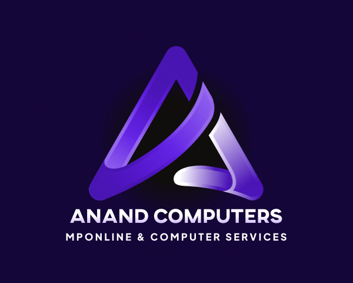

# MPOnline & Computer Services Portal

[](https://anand-computer.vercel.app)
[](https://github.com/Anand-Baghel/Anand-Computer)
[](LICENSE)

[](https://nextjs.org/)
[](https://reactjs.org/)
[](https://www.typescriptlang.org/)
[](https://tailwindcss.com/)
[](https://vercel.com)

Welcome to the "MPOnline & Computer Services Portal"! This modern web portal provides government and digital services in Madhya Pradesh, built with Next.js and TypeScript. Experience seamless access to various government services and computer solutions.

## About This Project

### What is MPOnline Portal?

MPOnline Portal is a comprehensive digital platform that bridges the gap between citizens and government services in Madhya Pradesh. It provides easy access to various government services, computer solutions, and digital services, making it convenient for citizens to avail these services from the comfort of their homes.

### How Does It Work?

The portal uses modern web technologies to provide a seamless user experience. It features:
- Bilingual support (English and Hindi)
- Dark/Light theme
- Responsive design for all devices
- Secure authentication system
- Interactive service catalog
- Real-time service tracking

## Preview of Project



## Explore the Project

[](https://anand-computer.vercel.app)

### Features

- **Bilingual Support**: Access the portal in both English and Hindi languages.

- **Modern UI/UX**: Enjoy a beautiful, responsive interface with dark/light theme support.

- **Government Services**: Access various government services including:
  - Birth Certificate
  - Income Certificate
  - Property Tax
  - Aadhaar Services

- **Computer Services**: Get professional computer services and solutions.

- **Web Solutions**: Access web development and digital solutions.

- **Contact System**: Easy-to-use contact form with email notifications.

## Technologies Used

This project leverages the following technologies:

- [Next.js](https://nextjs.org/) - React framework for production
- [TypeScript](https://www.typescriptlang.org/) - Type-safe JavaScript
- [Tailwind CSS](https://tailwindcss.com/) - Utility-first CSS framework
- [React Icons](https://react-icons.github.io/react-icons/) - Icon library
- [Three.js](https://threejs.org/) - 3D graphics library
- [Vercel](https://vercel.com) - Deployment platform

## Installation

To run this project locally, follow these steps:

1. Clone the repository to your local machine:

   ```shell
   git clone https://github.com/Anand-Baghel/Anand-Computer.git
   ```

2. Navigate to the project directory:

   ```shell
   cd Anand-Computer
   ```

3. Install the required dependencies:

   ```shell
   npm install
   ```

4. Create a `.env.local` file with the following variables:
   ```
   SMTP_HOST=smtp.gmail.com
   SMTP_PORT=465
   SMTP_USER=your-email@gmail.com
   SMTP_PASSWORD=your-app-specific-password
   ADMIN_EMAIL=admin@mponline.gov.in
   ```

5. Run the development server:

   ```shell
   npm run dev
   ```

6. Open [http://localhost:3000](http://localhost:3000) in your browser.

## Discover Our Services

Explore the MPOnline Portal and discover a wide range of government and digital services. Visit the [Live Demo](https://anand-computer.vercel.app) and experience the convenience of digital services.

## Contribute

If you'd like to contribute to this project or have suggestions for improvement, please feel free to submit issues or pull requests on [GitHub](https://github.com/Anand-Baghel/Anand-Computer).

Thank you for exploring the MPOnline & Computer Services Portal! We hope this platform makes accessing government services easier for you. 🌟
